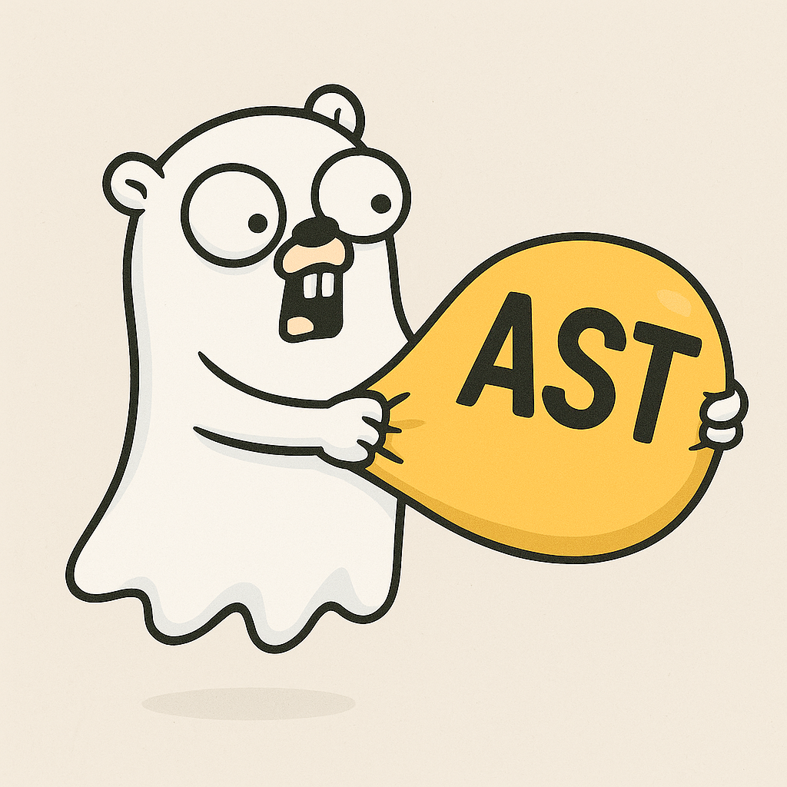

# goasted

A no-nonsense Go linter that enforces best practices and calls out bad habits.

## Why?

After dealing with too many substandard former Java developers who brought their shitty habits to Go, lazy Go programmers who can't be bothered to use their context params for database calls, and developers who think `if err != nil { t.Errorf(...) }` is "too verbose" - this tool exists to roast your code until it's properly done.

## What it catches

### 1. **testify-usage** - No testify allowed
Stop being lazy. Go's standard testing package is perfectly fine. If you think `if err != nil { t.Errorf(...) }` is too verbose, you're in the wrong language.

**Bad:**
```go
func TestSomething(t *testing.T) {
    assert.Equal(t, expected, actual)
}
```

**Good:**
```go
func TestSomething(t *testing.T) {
    if actual != expected {
        t.Errorf("got %v, want %v", actual, expected)
    }
}
```

### 2. **sql-context-required** - Use your damn context
If you're making database calls without using context, you're doing it wrong. Context exists for a reason: timeouts, cancellation, tracing. Use it.

**Bad:**
```go
rows, err := db.Query("SELECT * FROM users")
tx, err := db.Begin()
```

**Good:**
```go
rows, err := db.QueryContext(ctx, "SELECT * FROM users")
tx, err := db.BeginTx(ctx, nil)
```

### 3. **gokit-usage** - No go-kit
We don't want go-kit here. It's bloated Java-style over-engineering. Go is supposed to be simple.

## Installation

```bash
go install github.com/Arneball/goasted@latest
```

Or build from source:

```bash
git clone https://github.com/Arneball/goasted.git
cd goasted
go build
```

## Usage

Analyze a single file:
```bash
goasted -path main.go
```

Analyze a directory (recursively):
```bash
goasted -path ./src
```

Analyze current directory:
```bash
goasted
```

Select specific rules:
```bash
goasted -rules testify-usage,sql-context-required
```

Output format for CI/CD integration:
```bash
goasted -format junit -path ./src
```

### Output formats

- **text** (default): Human-readable plain text output
- **junit**: JUnit XML format for CI/CD integration

## CI/CD Integration

### GitLab CI

Use JUnit format to display violations in GitLab merge requests:

```yaml
lint:
  stage: test
  script:
    - go install github.com/Arneball/goasted@latest
    - goasted -format junit -path . > goasted-report.xml || true
  artifacts:
    reports:
      junit: goasted-report.xml
    when: always
```

This will:
- Show violations in the merge request UI
- Mark the pipeline as failed if violations are found
- Display each violation as a failed test case

### GitHub Actions

```yaml
- name: Run goasted
  run: |
    go install github.com/Arneball/goasted@latest
    goasted -format junit -path . > goasted-report.xml
  continue-on-error: true

- name: Publish Test Report
  uses: mikepenz/action-junit-report@v3
  if: always()
  with:
    report_paths: 'goasted-report.xml'
```

### Jenkins

Configure Jenkins to collect JUnit test results:

```groovy
stage('Lint') {
    steps {
        sh 'goasted -format junit -path . > goasted-report.xml || true'
    }
    post {
        always {
            junit 'goasted-report.xml'
        }
    }
}
```

## Exit codes

- `0` - No violations found
- `1` - Violations found (or error occurred)

## Examples

The `examples/` directory contains sample files demonstrating violations:

```bash
goasted -path ./examples
```

Expected output:
```
Found 28 violation(s):

examples/bad_test.go:6:2: [testify-usage] Test file imports testify package: github.com/stretchr/testify/assert
examples/bad_test.go:7:2: [testify-usage] Test file imports testify package: github.com/stretchr/testify/require
examples/bad_test.go:13:2: [testify-usage] Test code calls testify method: assert.Equal
examples/bad_test.go:17:2: [testify-usage] Test code calls testify method: require.NotNil
examples/sql_bad.go:15:12: [sql-context-required] Use ExecContext instead of Exec (called on db of type *database/sql.DB)
examples/sql_bad.go:21:15: [sql-context-required] Use QueryContext instead of Query (called on db of type *database/sql.DB)
...
```

## Adding custom rules

Adding a new rule is straightforward:

1. Create a new file in `rules/` (e.g., `rules/your_rule.go`)
2. Implement the `Rule` interface:
   ```go
   type YourRule struct{}

   func (r *YourRule) Name() string { return "your-rule" }
   func (r *YourRule) Description() string { return "What it checks" }
   func (r *YourRule) Check(ctx *Context) []Violation { /* ... */ }
   ```
3. Register it in `main.go`:
   ```go
   registry.Register(rules.NewYourRule())
   ```

See existing rules in `rules/` for examples.

## Philosophy

This tool is opinionated by design. It enforces practices that lead to maintainable, idiomatic Go code. If you disagree with the rules, fork it or don't use it. The goal is to catch bad habits before they infect your codebase.

## Why goasted?

It what you get when you mix AST with Go, and a tiny bit of goatse, and roasted.

## License

AGPL-3.0
